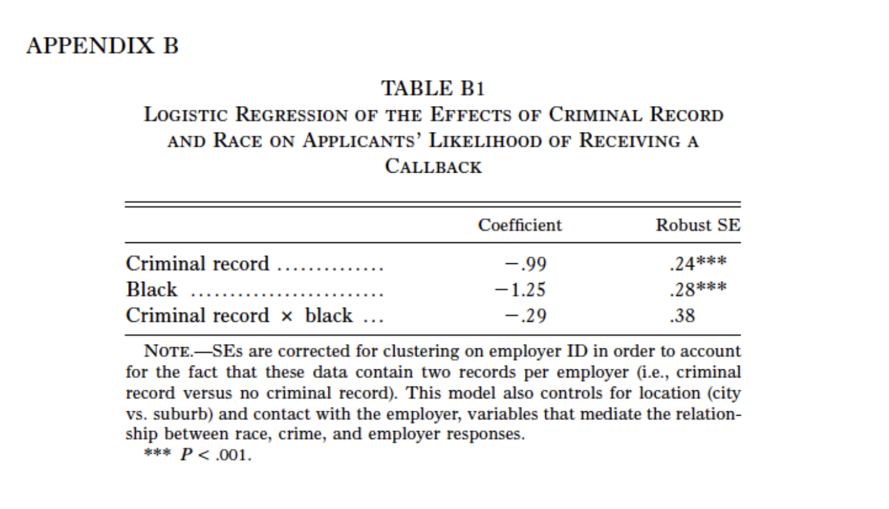

# Part 0: Logistics

* Lab next week (11/14) will end at 12:15pm 
* November 26th is a legislative Friday, so lab will meet Wednesday that week instead of Friday

# Part 1: Quiz #4 Review & Extensions

{width=70%}

1. What is the regression formula for this model? (Assume an intercept of $\beta_0$ = .54)


2. What do these coefficients represent? If you exponentiate the value of the coefficients, what do they represent now?

5. Ignoring the interaction effect, write a sentence causally interpreting the effect of having a criminal record on prospects of receiving a callback. 

7. What is the probability of a White job seeker with a criminal record receiving a callback? What is the probability of a Black job seeker without a criminal record receiving a callback? Write a sentence comparing the chances of receiving a callback for a White job seeker with a criminal record and a Black job seeker without a criminal record. 

# Part 2: F-test for Nested Models

- We can use F-test to compare two regression models. The idea behind the F-test for nested models is to check **how much errors are reduced after adding additional predictors**.  A relatively large reduction in error yields a large F-test statistic and a small P-value. The P-value for F statistics is the right-tail probability.  

- If the F's p-value is significant (smaller than 0.05 for most social science studies), it means that at least one of the additional $\beta_j$ in the full model is not equal to zero.  
  
- The F test statistic for nested regression models is calculated by:

$$F = \frac{(SSE_\text{restricted} - SSE_\text{full})/df_1}{SSE_\text{full}/df_2} $$
where $df_1$ is the number of **additional** predictors added in the full model and $df_2$ is the **residual degrees of freedom for the full model**, which equals $(n - 1 - \text{number of IVs in the complete model})$. The $df$ of the F test statistic is $(df_1, df_2)$.  

For example, let's look at the earnings data set we used previously. 

```{r setup, include=TRUE, warning=FALSE, message=FALSE}
knitr::opts_chunk$set(echo = TRUE, 
                      cache = FALSE,
                      fig.align = "center",
                      fig.width = 4.5,
                      fig.height = 4,
                      letina = TRUE)

pacman::p_load(
  tidyverse,
  stargazer,
  psych
)
```

Performing the same cleaning operations as last time:

```{r}
## read data
earnings_df <- read.csv("data/earnings_df.csv", stringsAsFactors = F)

## recode age
earnings_df <-
  earnings_df %>%
  mutate(age = case_when(
    age > 9000 ~ NA,
    .default = age
  ))

## recode female
earnings_df <- earnings_df %>% 
  mutate(female = case_when(
    sex == "female" ~ 1, 
    .default = 0)) 

## base R way of doing it
earnings_df$female <- 0
earnings_df[earnings_df$sex=="female", "female"] <- 1

## create black and other
earnings_df <- 
  earnings_df %>%
  mutate(black = case_when(
    race == "black" ~ 1,
    .default = 0
  )) %>%
  mutate(other = case_when(
    race == "other" ~ 1,
    .default = 0
  ))
```


And running models #3 and #4 from previous labs:

(3) Model 3: earn ~ age + edu + female
(4) Model 4: earn ~ age + edu + female + race

```{r, warning=FALSE, message=FALSE, results='asis'}
m3 <- lm(earn ~ age + edu + female,
         data = earnings_df)

m4 <- lm(earn ~ age + edu + female + black + other,
         data = earnings_df)

stargazer(m3, m4,
          type = "latex")
```

According to the equation we just wrote out above, we can hand-calculate the F value for `m3` vs `m4`:

```{r F-hand}

# SSE_restricted:
sse_m3 <- sum(m3$residuals^2)

# SSE_full:
sse_m4 <- sum(m4$residuals^2)

# We add one additional IV, so:
df1 <- 2

# Residual df for the full model (m5):
df2 <- m4$df.residual

# Calculate F:
F_stats <- ((sse_m3 - sse_m4)/df1)/(sse_m4/df2)
F_stats

# Check tail probability using `1 - pf()`
1 - pf(F_stats, df1, df2) 
```
  
- *Question:* What is your null and alternative hypotheses? What's your decision given the F-test result?  

- You can also use `anova()` to perform a F-test in R. 

```{r anova}

anova(m3, m4)

```
- *Question:* In your own words, what is an ANOVA test doing? How is this different from a t-test or a linear regression? 

# Part 4: Exercise (20 minutes)

How does the number of theaters a movie opens in affect the total box office earnings of that movie? How much of an increase in box office earnings can producers expect for each theater their movie plays in? Using your knowledge of linear regressions and this (fake!) dataset, model the relationship between number of theaters and box office earnings. Explore the dataset and try to create the best model you can for isolating the effect of theaters on box office earnings. Make sure to check that linear regression assumptions are satisfied and compare models using the tests we learned about in lecture. Report the results of your best regression model in a clean table.

Variables:

*theaters:* # of theaters that showed the movie on opening weekend

*reviews:* average score reviewers gave the movie (1-10 with 10 being most positive)

*series:* dummy variable for whether the movie is part of a series (1 if yes)

*budget:* budget of movie in 1000s of dollars

*studio:* studio that released the movie

*boxoffice_earnings:* how much money the movie made on opening weekend in 1000s of dollars

* Explore the data

```{r}
# reading in data
boxoffice <- read.csv("data/boxoffice.csv")
```
