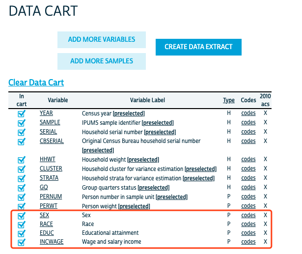
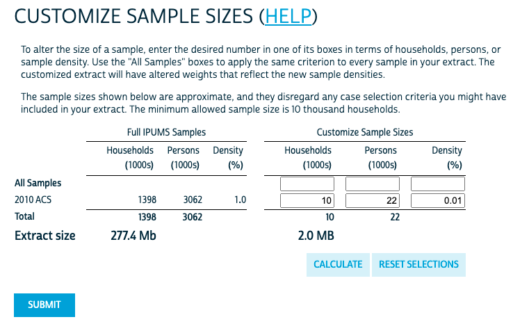
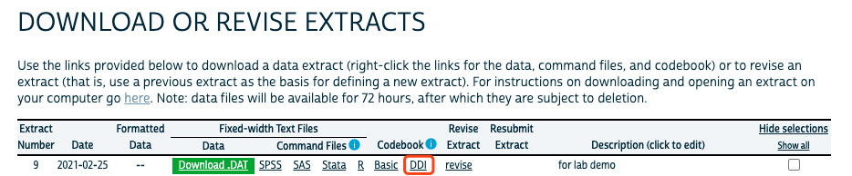
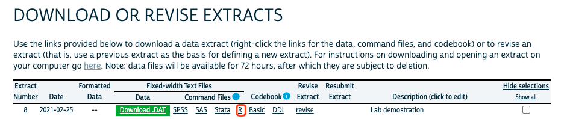
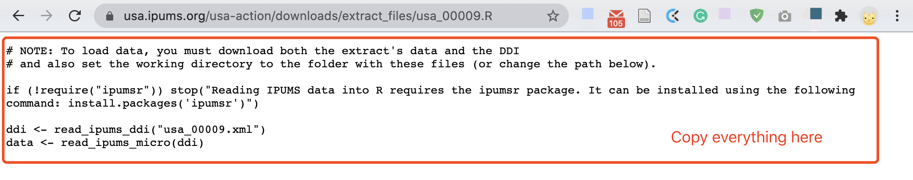
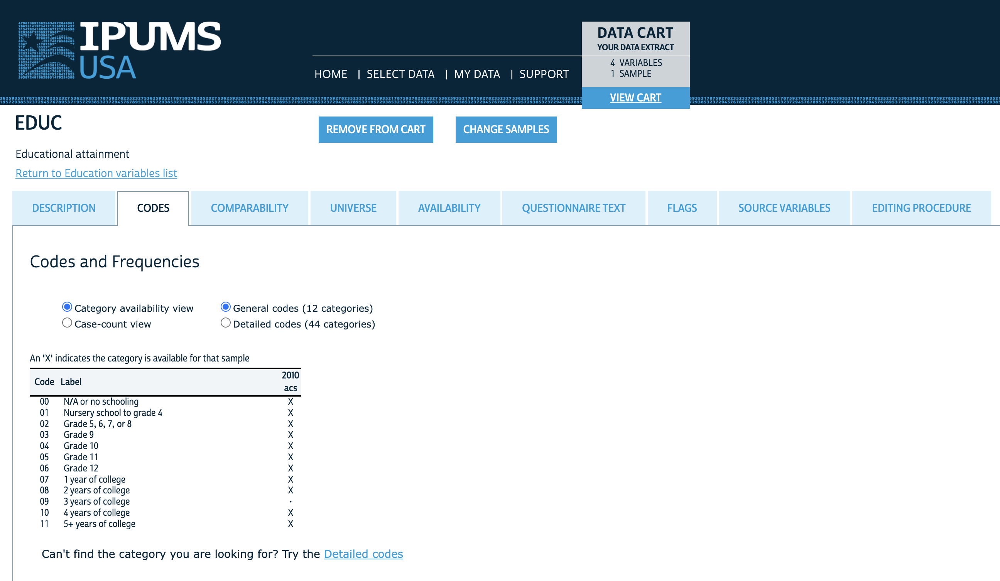

```{r setup, include=TRUE, message=FALSE}
knitr::opts_chunk$set(echo = TRUE, fig.pos = "H", out.extra = "")

pacman::p_load(
  tidyverse,
  kableExtra,
  ipumsr, # for reading IPUMS data into R
  ggplot2
)
```

# Part 1: Reviewing P-values

* $p$-value is the probability that the test statistic equals to (or is more extreme than) what we observed 

* **Probability Density Function (PDF):** a function that gives the probability of getting each value of a continuous variable on a random draw. 

$$
\text{PDF}(x) = P(X = x)
$$

```{r}
# plotting a PDF of a standard normal distribution

# creating a data frame with an x-axis range for the plot
plot_data <- data.frame(x = c(-4, 4))

# Plot the normal distribution PDF
ggplot(data = plot_data, aes(x = x)) +
  stat_function(fun = dnorm,  # telling it to plot every value of the density function for the normal distribution
                args = list(mean = 0, sd = 1), # providing the parameters for a standard normal distribution
                color = "blue", # setting the color of the line
                ) + 
  labs(title = "Probability Density Function (PDF) of a Standard Normal Distribution",
       x = "Value",
       y = "Density") +
  theme_minimal() # applying a clean theme for the plot
```

* 

    * What does the area under any PDF sum to? 1 (there is an 100% probability that you draw any of the values from the distribution)
    
    * Why can't we just use the value of the PDF as our p-value? Because that would only be the probability of getting your exact test statistic under the null hypothesis. It would not include the probability of getting a test statistic even more extreme.

* The integral of this function (i.e. all the area under the curve from point A to B) gives us the **Cumulative Distribution Function (CDF)**, which is the probability at each value of a continuous variable that if you take a random draw from the variable, you will get a value less than or equal to that value. 

$$
\text{CDF}(x) = P(X ≤ x) = \int_{-\infty}^{x}\text{PDF}(t)dt
$$

```{r}
# plotting a CDF of a standard normal distribution

# creating a data frame with an x-axis range for the plot
plot_data <- data.frame(x = c(-4, 4))

# Plot the normal distribution PDF
ggplot(data = plot_data, aes(x = x)) +
  stat_function(fun = pnorm,  # telling it to plot every value of the density function for the normal distribution
                args = list(mean = 0, sd = 1), # providing the parameters for a standard normal distribution
                color = "blue", # setting the color of the line
                ) + 
  labs(title = "Cumulative Distribution Function (CDF) of a Standard Normal Distribution",
       x = "Value",
       y = "Cumulative Probability Density") +
  theme_minimal() # applying a clean theme for the plot
```

* Last week we introduced the `pt()` function for calculating p-values in R. Let's break down what the `pt()` does in more detail. 

    * `p` is for probability and `t` is for t-test. 
    
    * This function gives the value of the cumulative distribution function (or the integral of the probability density function) at the point you specify.
    
    * In the `pt()` function, you enter your degrees of freedom (the only parameter needed for a t-test) and a test parameter value, then the function generates a t-distribution (which assumes null hypothesis and is therefore centered around 0) and calculates the value of the CDF for that distribution at your test statistic value. 

    * `pt(q = observed_t, df = your_degree_of_freedom, lower.tail = FALSE)` calculates the probability of randomly drawing a value on the null t distribution with your degrees of freedom that is between your observed test statistic and positive infinity. The `lower.tail = FALSE` argument tells it to calculate the upper tail rather than the lower tail, i.e. your test statistic or higher rather than your negative test statistic and lower
    
    * Why do we multiply this function by two when we're doing a two-tailed test? `2*pt(q = observed_t, df = your_degree_of_freedom, lower.tail = FALSE)`. Because we want the area under both tails and this just calculates the area under the right-hand side one.
    
    * When we get to regressions next week, the `lm()` command in R will do a lot of this work automatically for you, but the same calculations of the PDF and CDF still apply. 

# Part 2: IPUMS!

## Exercise 1: Download Data from IPUMS

1. Register an account for using IPUMS-USA [here](https://usa.ipums.org/usa/)
2. Once your account is created, log in to IPUMS-USA and create a data extract request by selecting the **2010 ACS** sample and the **SEX**, **EDUC**, and **INCWAGE** variables. You can keep the preselected variables. Your "Data Cart" should be similar to this:  

<center>
{width=50%}
</center>  

3. To save time, create a small data extract with a customized sample size of **0.01%**. As shown in the following screenshot. Submit your data extract request. 

<center>
{width=50%}
</center> 

4. While IPUMS is processing our data extract request, you can prepare the file needed for loading the IPUMS data to R. Open the "DDI" page in your browser, it should be a `.xml` page. Save this `.xml` file to your current lab folder, or you can save it in a sub-folder devoted to data files, such as a sub-folder called "data" within your current lab folder.

<center>
{width=60%}
</center>  


5. Once your data is ready on IPUMS, you will receive an email with a download link. (The wait time varies from a couple minutes to a couple days, depending on how large your files are and how busy the server is.) Follow the link in your email and download your data (the default format is `.dat.gz`). **Make sure to save it at the same directory with your `.xml` file**

6. Unzip the `.gz` data file using your computer's unzip applications (for Mac users, if the default extractor doesn't work, try the [Unarchiver application](https://theunarchiver.com/)). Now you should have the `.dat` file and the `.xml` file in the same directory. 

7. Load the data to your R environment, by using the code shown in the webpage when you click the `R` Command File link in your IPUMS data downloading page. You may have to change the name of the file or the path to the file in the code.

<center>
{width=60%}
</center>

<center>
{width=60%}
</center>


```{r part2-exercise1-ipums}
## NOTE: To load data, you must download both the extract's data and the DDI
## and also set the working directory to the folder with these files (or change the path below).

if (!require("ipumsr")) stop("Reading IPUMS data into R requires the ipumsr package. It can be installed using the following command: install.packages('ipumsr')")

ddi <- read_ipums_ddi("data/usa_00043.xml")
data <- read_ipums_micro(ddi)
```

## Reading IPUMS Documentations

Before working with the data, we should be clear about how the variables are coded. You can access the documentation of each variables through the `.xml` webpage you opened earlier.  

<center>
{width=60%}
</center>  

When you have that page open in your browser, click "Variable Description" to access the codebook for each variables we just downloaded. 

<center>
{width=60%}
</center>  

The other way is to read the documentation of each variable directly in the online system. This is my preferred approach.

<center>
{width=60%}
</center>  

## Exercise 2: Reading the Data Codebook (15 minutes)

Go through the variable description, and answer the following question:

1. What does the variable "PERNUM" represents? How can you uniquely identify each person within the IPUMS with this variable? 

It numbers everyone in the household. When combined with SAMPLE AND SERIAL, you can uniquely identify everyone in IPUMS with this variable. 

2. What does the variable "PERWT" represents? When should you consider using this variable?   

It indicates how many people in the U.S. are represented by a given person in the sample (i.e. weights the variables). You should use this variable when conducting any person-level analysis. 

3. For the variable "SEX", what are the possible values it can take? What does each value represent? Try run `str(data$SEX)`, what do you see?

SEX can be 1, 2, or 9. When we do the `str()` command we see no one in our dataset has a missing or blank SEX.

```{r}
str(data$SEX)
```


4. What does the variable "EDUC" represents? How many values this variable can take? What is the value that represents N/A?   

It represents the highest year of schooling or degree completed. It can take on 13 values, with 00 = N/A

5. For the variable "INCWAGE", what are the codes for N/A and missing data?

999999 = N/A
999998 = Missing

## Exercise 3: Running a t-test with IPUMS data (20 minutes)

We will try to run a t-test on the average income in highly educated people versus people with lower levels of formal education. So we will be using the **education and wage income** variables. (Normally we would do this exercise with regressions, but since we haven't done that lecture yet we'll do the same data cleaning steps but then run a t-test instead). First, we need to make sure we know how the variables are distributed in the sample and remove N/A and missing values (we do not consider imputing missing values at this point).

*Note:* Since we each extracted a 0.01% random sample, it is normal if your results are slightly different from this demo.  

1. First, make sure your data is loaded in your environment. 

```{r import IPUMS}
## load ipums data
ddi <- read_ipums_ddi("data/usa_00043.xml")
data <- read_ipums_micro(ddi)
```

2. Then, create a new dataset that keeps only the following variables for subsequent data analysis: SAMPLE, EDUC, INCWAGE

```{r IPUMS select var}

## select variables
data_clean <- data %>%
  select(PERWT, SEX, EDUC, INCWAGE)

```

3. Removing missing values

Since we are running a t-test with **education and wage income**, we need to remove observations that do not have any of the two values. You can either remove then by filtering out the values that represent N/A or missing based on the variable codebook, or you can recode these values to `NA` so that you keep all the observations. For this example we will do the former, but we will cover the latter method in the future. 

First, check the coding scheme for each variable of interest in the codebook. Then, filter out the missing values. Last, check the new distributions for each variable with a table or plot.

```{r remove missing, fig.height = 3, fig.width = 3, fig.align = "center"}

## check number of observations for each value of EDUC
table(data_clean$EDUC)

## check coding scheme for EDUC in codebook
## --> we need to remove value 0, which means N/A or no schooling

## check distribution of INCWAGE
data_clean %>%
  ggplot() +
  geom_histogram(aes(INCWAGE), binwidth = 15000, color = "black", fill = "grey")

## check coding scheme for INCWAGE in codebook
## --> we need to remove value 999998 (missing) and value 999999 (N/A) 
max(data_clean$INCWAGE)

## remove missing value use filter()
data_clean <- data_clean %>%
  filter(EDUC != 0 & INCWAGE < 999998)

## check distribution after removing missing values
## EDUC
table(data_clean$EDUC)

## INCWAGE
data_clean %>%
  ggplot() +
  geom_histogram(aes(INCWAGE), binwidth = 15000, color = "black", fill = "grey")
```

4. Now, let's try to estimate whether the difference in income between highly educated people and people with less education is statistically significant. First, create two education groups: one of people who completed high school or less (Grade 12 or lower) and one of people who completed 4 years of college or more. You can do this by creating two new datasets or by creating an indicator variable in the existing dataset. 

```{r}
# two new datasets
# creating low education group
low_educ <- data_clean %>% 
  filter(EDUC < 7)

# creating high education group
high_educ <- data_clean %>% 
  filter(EDUC > 9) 

# indicator variable

data_educ <- data_clean %>%
  mutate(high_low_educ = case_when(EDUC < 7 ~ "low", 
                                   EDUC > 9 ~ "high", 
                                   TRUE ~ NA_character_))

# Be careful of doing less than/greater than commands without looking at the codebook! You might be including missing codes or other unwanted levels.
```


5. Make a plot showing the difference in means between these groups. Feel free to use any plot format you think best shows this difference. 

```{r}
data_educ %>%
  filter(high_low_educ %>% is.na() == FALSE) %>% 
  ggplot(aes(x = high_low_educ, 
             y = INCWAGE)) + 
  geom_boxplot() + 
  labs(
    title = "Boxplot of Education Level by Income",
    x = "Education Level",
    y = "Income"
  )
```

6. Now run a t-test to see if the difference in income between the high and low educated groups is statistically significant. Explain what the meaning of the p-value is (using the ideas we covered at the beginning of lab). Interpret both the statistical and substantive significance of the results. 

```{r}
t.test(
  x = low_educ$INCWAGE,         
  y = high_educ$INCWAGE,        
  mu = 0,   
  alternative = "two.sided"
)
```
We got a p-value < 2.2e-16. This means that the integral of the PDF (or the value of the CDF) at our specified t-statistic (-35.828) is exceedingly small, meaning the probability of having drawn a value that or more extreme by random chance is exceedingly low. We can reject the null hypothesis that there is no difference in mean income between people with higher and lower levels of formal education. The observed difference in means is quite large, meaning this is a substantively significant result as well as statistically significant. 

