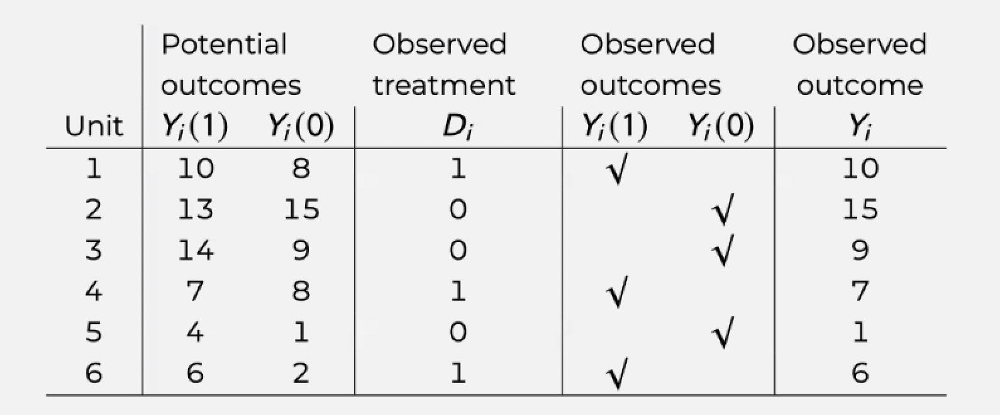

```{r}
pacman::p_load(
  tidyverse
)
```

# Logistics

* Everyone did great on problem set #2, no notes

* **Problem set #3** will be released today and is due date Nov. 14th (11:59pm)

* Happy to talk about methods classes for next semester

* [Lab feedback survey](https://docs.google.com/forms/d/e/1FAIpQLSeVI4DOH6onaXBUXKY8NMAEnswJnY5a1iZqa6_ilek7O0WuGQ/viewform?usp=dialog)

# Part 1: The Potential Outcome Framework of Causality

## 1.1 The Fundamental Problem of Causal Inference

* The modern way of thinking about causality is to think about outcomes in a counterfactual approach

* For example, the effect of a policy treatment on an outcome $Y$, is to think about the difference between $Y_{i}^{t}$, i.e., the potential outcome of individual $i$ receiving the treatment, and $Y_{i}^{c}$, i.e., the potential outcome of **the same individual**, if not receiving the treatment. Either one of the two terms is never observed.

  + Notation-wise, $Y^{c}$ and $Y^{t}$ are both **potential outcomes** (i.e., Rubin's approach)
  + ATE is defined as $ATE = \mathbb{E}[Y_{i}^{t}] - \mathbb{E}[Y_{i}^{c}] = \mathbb{E}[Y_{i}^{t}-Y_{i}^{c}]$
  + We can only observe $\mathbb{E}[Y_{i}^{t} | D_i = 1]$ and $\mathbb{E}[Y_{i}^{c} | D_i = 0]$
  
* However, the ATE is just one parameter we can try to measure. We can also estimate the ATT and the ATC. 

    + What is the ATT and ATC?
    
Average Treatment effect on the Treated and Average Treatment effect on the Control

    + How would you write out the formula for the ATT with this potential outcome notation?
    
$$
ATT = {E}[Y_{i}^{t}|D_i = 1] - \mathbb{E}[Y_{i}^{t}|D_i = 0]
$$

## 1.2 Naive Estimation of the Average Treatment Effect

* At the population level, the **average treatment effect (ATE)** is defined as:

$$\tau = ATE = \mathbb{E}[Y_{i}^{t} - Y_{i}^{c}] = \mathbb{E}[Y_{i}^{t}] - \mathbb{E}[Y_{i}^{c}]$$

* Since we do not observe the population level $Y^T$ or $Y^C$, the naive approach to estimate the population level ATE uses the following equation:

$$\hat{\tau} = \mathbb{E}[Y_{i}^{t}|D_i = 1] - \mathbb{E}[Y_{i}^{c}|D_i = 0]$$
  
* which calculates the difference in the expected value of $Y_i$ in the observed treated group ($\mathbb{E}[Y_{i}^{t}|D_i = 1]$) and the expected value of $Y_i$ in the observed control group ($\mathbb{E}[Y_{i}^{c}|D_i = 0]$).  
  
* The estimated naive ATE will be unbiased **if the assignment to treatment is purely random**.  

## Part 1 Exercise
Assuming you know both potential outcomes $Y_i^t$ and $Y_i^c$ on the same individual, as well as their realized outcomes. Answering the following questions:

<p align="center">
{width=70%}
</p> 

1. Calculate ATE: 

$$
ATE = \frac{2 - 2 -5 +1 -3 - 4}{6} = \frac{-11}{6} = -1.83
$$

2. Calculate ATT: 

$$
ATT = \frac{-2 + 1 - 4}{3} = \frac{-5}{3} = -1.67
$$

3. Calculate ATC:

$$
ATC = \frac{2 -5 - 3}{3} = \frac{-6}{3} = -2
$$


4. Naive estimate of the ATE:

$$
ATE = \frac{10 + 7 + 6}{3} - (\frac{15 + 9 + 1}{3}) = \frac{23-25}{3} = \frac{-2}{3} = -.667
$$

5. What causes the naive ATE to deviate from the true ATE in this example? 

Seems like the controls are not a good representation of the treated if they were not treated (and vice versa). For the naive ATE to equal the true ATE, the ATE would have to equal the ATT and the ATC.

# Part 2: Assumptions of Causal Inference 

Assumptions necessary for causal inference in linear regressions:

* Ignorability (no selection bias)

* SUTVA

* Overlap

* Parametric assumptions 

## 2.1 Ignorability (No Selection Bias)
  
* If there are selection biases that lead to certain kinds of units being more likely to go into the treatment or control group, the naive estimator will be biased.  
  
* This is due to the fact that this additional factor is related to both assignment to treatment and the potential outcome.  

* As covered in the lecture, we can decompose the naive estimator to:

$$
\begin{aligned}
\hat{\tau} &= \mathbb{E}[Y_{i}^{t}|D_i = 1] - \mathbb{E}[Y_{i}^{c}|D_i = 0] \\ 
&= \underbrace{\mathbb{E}[Y_{i}^{t}|D_i = 1] - \mathbb{E}[Y_{i}^{c}|D_i = 1]}_{\text{ATT}} + \underbrace{\mathbb{E}[Y_{i}^{c}|D_i = 1] - \mathbb{E}[Y_{i}^{c}|D_i = 0]}_{\text{selection bias}}
\end{aligned}
$$

where $\mathbb{E}[Y_{i}^{t}|D_i = 1] - \mathbb{E}[Y_{i}^{c}|D_i = 1]$ is the **treatment effect on the treated** and $\mathbb{E}[Y_{i}^{c}|D_i = 1] - \mathbb{E}[Y_{i}^{c}|D_i = 0]$ is the **selection bias**. You can think of it as the baseline difference of $Y_i$ if both the treatment and the control group are not treated.

* For example, if family income both affects the likelihood of a child going to college ($D_i=1$) and potential future income ($Y_i$), will the selection bias be positive or negative? Will the naive estimation of ATE estimating the income returns to college education **overestimate** or **underestimate** the true causal college effect?

Overestimate

* There is also a definition of the **treatment effect on the control** (ATC), which can be expressed as $\mathbb{E}[Y_{i}^{t}|D_i = 0] - \mathbb{E}[Y_{i}^{c}|D_i = 0]$

* In old-school regression adjustments (i.e., including controls), the assumption is that

* $\underbrace{\mathbb{E}[Y{_i}^c|D_i=1, X_i] - \mathbb{E}[Y_{i}^c|D_i=0,X_i]}_{\text{selection bias}} = 0$

  + This is a strong assumption, i.e., strong ignorability assumption
  + Failure to satisfy the assumption will lead to omitted variable bias, or selection bias, or the violation of zero-conditional mean assumption

## 2.2 SUTVA

* In lecture we talked about how SUTVA (Stable Unit Treatment Value Assumption) can be violated if one observation's treatment affects another observation's treatment. 
    
    * What is an example of this in real life research?
    
Implementing a financial literacy program in one classroom might spillover to others if students talk. This is why researchers often use classrooms in geographically distant schools.

* Another way SUTVA can be violated is if different observations get different versions of the treatment.

    * What is an example of this?

Coding 1 hour of financial education and 100 hours as the same thing (different dosages). One classroom administering the financial literacy program differently than others. 

## 2.3 Overlap

* One other important assumption for causal inference is that there is overlap between units; that is, that there is a counterfactual unit for each observation.

* Let's say we want to investigate whether receiving personalized tutoring leads to higher earnings in the future. We create an experiment which randomly assigns college students to receive the tutoring program. In our regression, we also want to control for years of education, since we think those who have higher levels of education will probably earn more. 

* In this example, what is the treatment variable? What is the ATE measuring?

Treatment variable: whether they received the personalized tutoring

ATE: effect of personalized tutoring on earnings versus if that person had not had personalized tutoring

```{r}
# creating a dataset without overlap
earnings <- read.csv("data/earnings_df.csv") %>% 
  mutate(
    college = ifelse(edu > 4, "College", "No College"), # let's say edu = 5+ means you've atttended at least some college
    tutoring_program = rep(c("Yes", "No", "No", "Yes", "No"), times = 200), # creating a treatment variable: receiving a tutoring program in college
    tutoring_program = ifelse(college == "No College", "No", tutoring_program), # if you don't go to college, it's impossible to receive the tutoring program
  )

# plotting the overlap between an explanatory variable (education) and the treatment (receiving the tutoring program)
earnings %>%
  ggplot(aes(x = edu, 
             fill = tutoring_program)) +
  geom_histogram(position = "identity", 
                 alpha = 0.5) +
  theme_classic()
```

* In this data, we can't really say anything about how tutoring programs may increase the earnings of those with lower levels of formal education, because we only have untreated units at education levels 1-4. Therefore we have no counterfactual for these people's earnings if they *had* received tutoring. 

* Essentially you want at least one (preferably more) treatment unit and control unit with each combination of your explanatory variables.

* What kind of overlap you need depends on what test statistic you are calculating (ATE, ATT, ATC). What test statistic could we estimate with the earnings data above? 

ATT

* Another way you might violate the assumption of overlap is by extrapolating past the bounds of your data. For example, if we don't have any people in our data who went to graduate school, we can't talk about what the relationship between years of education and earnings is for those with more than a college education.

    + When you extrapolate past the bounds of your data you might be misspecifying your model! Ex. modelling a linear relationship when it's really exponential.

## 2.4 Parametric Assumptions

* Lastly, we need to satisfy all the parametric assumptions for causal inference from a linear regression to be valid. The parametric assumptions are all the Gauss-Markov assumptions we learned about for a OLS estimator to be BLUE, plus the additional assumption that errors are normally distributed. 

* The parametric assumptions are:

    + Linear relationship between X & Y
    + Random sampling, or no autocorrelation (the error terms aren't correlated with each other)
    + Error terms have a conditional mean of 0
    + No perfect multicollinearity between explanatory variables
    + Homoscedasticity (error terms have a constant variance)
    + Error terms are normally distributed

* What is the difference between satisfying the parametric assumptions and satisfying the Gauss-Markov assumptions? What does satisfying the Gauss-Markov assumptions tell you about your estimator versus what satisfying the causal inference assumptions tell you?

Parametric assumptions are necessary for causal inference. Gauss-Markov assumptions are for the estimator being BLUE, meaning it's about efficiency, not causal inference. 

## Part 2 Exercise

Think of a causal research question you are interested in studying (perhaps the one you're using for your NSF GRFP application in pro sem!).

1. State the the research question with counterfactual causal inference language. What is your null and alternative hypothesis? What parameter (ATE, ATT, ATC) are you calculating?

2. Go through the assumptions necessary for causal inference from linear regression. How might your data for your research question violate these assumptions? Can you predict any potential issues for valid causal inference?

# Part 3: Language for Interpreting Results

* The language you use to interpret your results is very important to make sure your readers understand exactly what you estimated and how you did it. So it's good to be precise with the language you use! There's no perfect formula for reporting results, but here are some elements that it's helpful to specify when you interpret your results:
    
    + **Inferential group:** what is the inferential group? I.e., what is the population you are making claims about?
    + **Treatment:** What is the treatment or key explanatory variable you're trying to make a causal (or correlative) claim about?
    + **Effect:** What effect did the treatment or key explanatory variable have on your outcome?
    + **Comparison group:** What is the relevant counterfactual comparison group? 
    
* Example causal interpretation: for adults over 21 years of age, getting a college degree led to a 10k increase in income on average relative to if those same adults had not gotten a college degree.

* Example non-causal interpretation: for adults over 21 years of age, getting a college degree was associated with a 10k increase in income on average relative to those who did not receive a college degree. 

## Part 3 Exercise

Let's say you ran the study you detailed in Part 2 Exercise and found results that confirmed your alternative hypothesis. Assuming you feel confident that your study design satisfies all the assumptions necessary for causal inference, write a sentence or two interpreting your results.  

# Part 4: Some Examples of Causal Inferential Studies

## Randomized treatment assignment 

The most straightforward approach is to manipulate treatment assignment to be completely random. In this case, selection bias is zero, by design.

[Effect of neighborhood stigma on economic transactions](https://www.pnas.org/doi/abs/10.1073/pnas.1414139112), The Proceedings of the National Academy of Sciences (PNAS)

  - Random assignment of seller's neighborhood information on an online market
  
[The mark of a criminal record](https://www.journals.uchicago.edu/doi/full/10.1086/374403), AJS

  - Random assignment of racial background of job seekers with criminal record
  - Are there any issues with this as a randomization? 
  
[Exposure to Opposing Views can Increase Political Polarization: Evidence from a Large-Scale Field Experiment on Social Media](https://www.pnas.org/doi/10.1073/pnas.1804840115), PNAS

  - Random assignment of Republican or Democrats voters to follow twitter accounts from elected officials and opinion leaders with opposing political views

## Quasi-random natural experiments

In many cases, experiments with random assignment is either unethical or unfeasible. People therefore turn to natural experiments, where assignment of treatment is quasi-random.

[Nation building through foreign intervention: Evidence from discontinuities in military strategies](https://academic.oup.com/qje/article/133/2/701/4110419), QJE

  - Quasi-random assignment of bombing and airstrikes in the Vietnam War
  
[Lifetime earnings and the Vietnam era draft lottery: evidence from social security administrative records](https://www.jstor.org/stable/2006669), AER

  - Quasi-random assignment of military participation in the Vietnam War

## An example of getting around randomization: instrumental variables

Instrumental variable designs use a randomly assigned variable that is moderated by the non-randomly assigned explanatory variable of interest to measure the effect of the explanatory variable on the outcome variable. A key assumption of these designs is that the instrumental variable only affects the outcome variable through the explanatory variable.

[Commitment through Sacrifice: How Longer Ramadan Fasting Strengthens Religiosity and Political Islam](https://journals-sagepub-com.proxy.library.nyu.edu/doi/full/10.1177/00031224221101204), ASR

  - IV from the time-shifting feature of Ramadan that makes the fasting duration vary from year to year
  
[Community and the Crime Decline: The Causal Effect of Local Nonprofits on Violent Crime](https://journals.sagepub.com/doi/full/10.1177/0003122417736289), ASR

  - IV from nonprofit organizations in art, media, and medical industries to instrument local nonprofit organizations targeting violent crimes
  
A common IV is weather (such as using rain as a quasi-random assignment of whether a protest will happen or not). However, this is problematic because weather often affects the dependent variable through mechanisms other than the independent variable. For more on this see [this paper](https://papers.ssrn.com/sol3/papers.cfm?abstract_id=3715610). 

There are many other ways to simulate randomized experiments with observational data that we will cover in future weeks! The RCT is considered the "gold standard" for causal inference that all other causal experimental designs are trying to achieve. 
